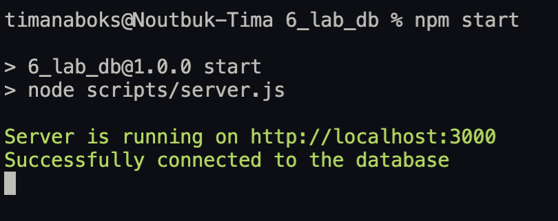
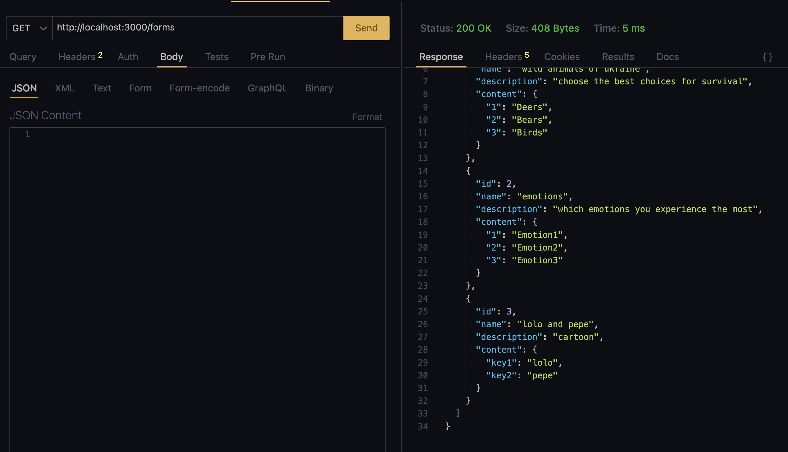
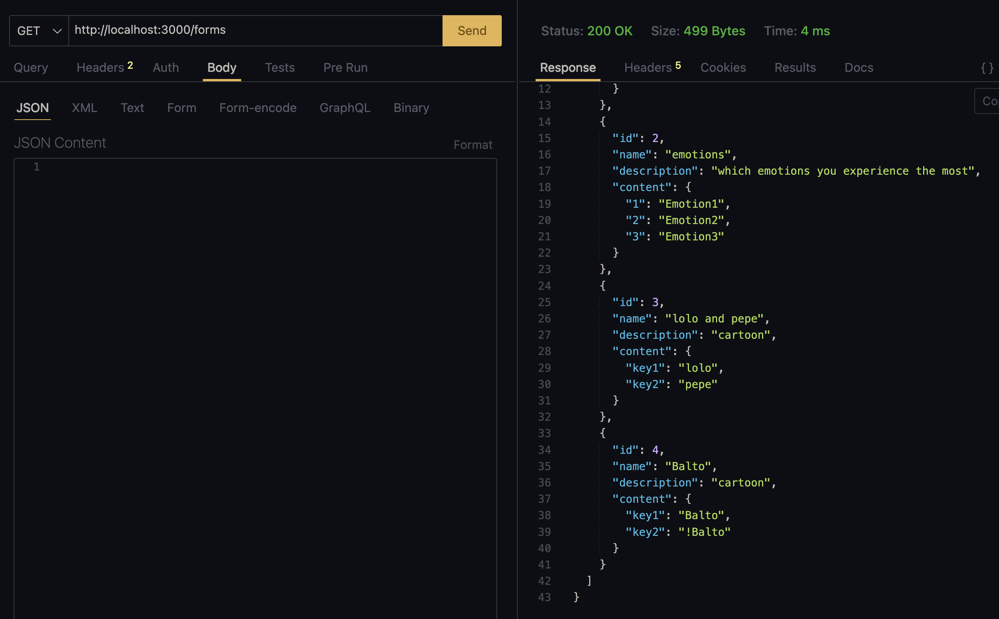
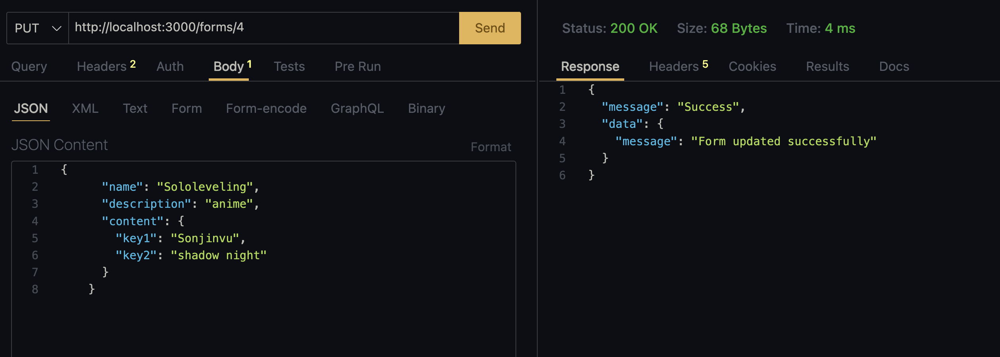
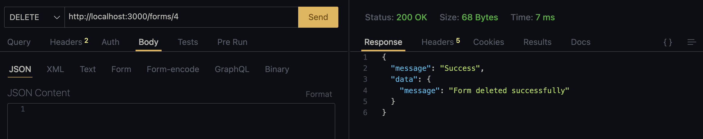
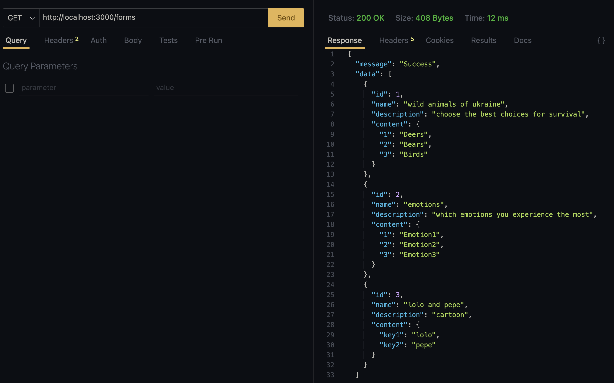

# Тестування працездатності системи

## Старт системи

    

## Список усіх поточних форм

    

## Створення нової форми

    

    

## Оновлення вибраної форми

    

    

## Видалення вибраної форми

    

    

